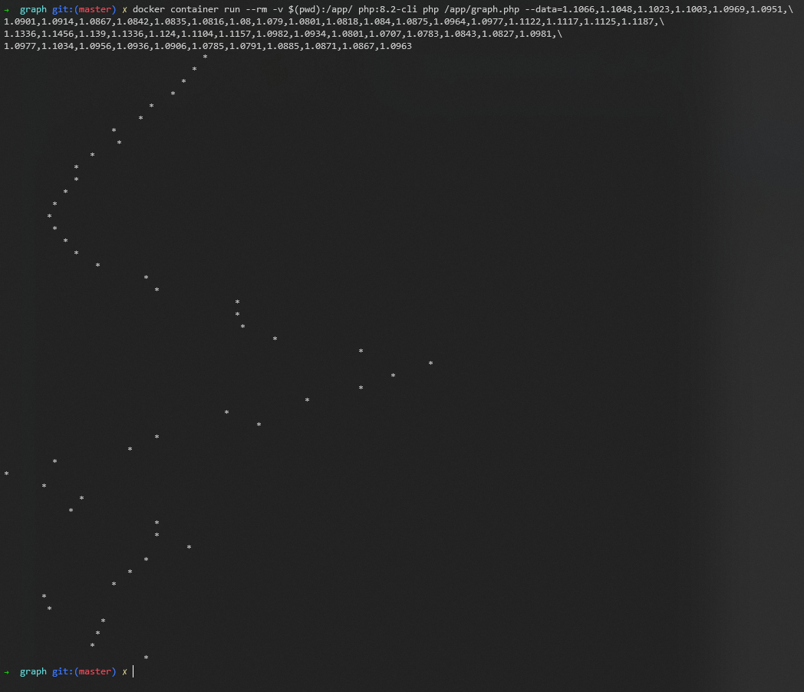

## Run:

### Step 1
```
git clone git@github.com:Viktor-V/graph.git
```

### Step 2
```
cd graph
```

### Step 3
```
docker container run --rm -v $(pwd):/app/ php:8.2-cli php /app/graph.php --data=1.1066,1.1048,1.1023,1.1003,1.0969,1.0951,\
1.0901,1.0914,1.0867,1.0842,1.0835,1.0816,1.08,1.079,1.0801,1.0818,1.084,1.0875,1.0964,1.0977,1.1122,1.1117,1.1125,1.1187,\
1.1336,1.1456,1.139,1.1336,1.124,1.1104,1.1157,1.0982,1.0934,1.0801,1.0707,1.0783,1.0843,1.0827,1.0981,\
1.0977,1.1034,1.0956,1.0936,1.0906,1.0785,1.0791,1.0885,1.0871,1.0867,1.0963
```

## Result:

